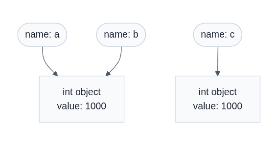

## Задание 1

### Часть 1

В интерактивном режиме интерпретатора было выполнено выражение `2 + 3 * 4`, после чего интерпретатор вывел в терминал  `14`. После этого то же самое выражение было записано в файл `task_1.py`. Ожидалось, что после запуска `task_1.py`  в терминал будет выведено `14`, но в результате запуска файла ничего не было выведено в терминал.

Так произошло, потому что в интерактивном режиме после ввода выражения интерпретатор вычисляет его и автоматически выводит полученное значение. Поэтому результат `14` отображается без специальной команды вывода.

При запуске файла интерпретатор выполняет инструкции программы, но значения отдельных выражений автоматически не выводит. Выражение `2 + 3 * 4` вычисляется однако это значение нигде не используется и не выводится. Чтобы результат вывелся в терминал при запуске `task_1.py`, нужно явно использовать `print()`:

```python
print(2 + 3 * 4)
```


### Часть 2

В следующем коде:

```python
course = "Python"
hours = 4 * 2
print(f"{course}: {hours} часов")
```

-  Являются выражениями:
    -  `"Python"`
    - `4 * 2` 
    - `f"{course}: {hours} часов"`
- Являются инструкциями:
    -  `course = "Python"`
    -  `hours = 4 * 2`
    -  `print(f"{course}: {hours} часов")`
- Присутствуют литералы:
    -  `"Python"`
    -  `4`
    -  `2` 
    -  Пробелы
    -  Двоеточие
    - `часов`
- Создаются имена:
    -  course
    -  hours
    -  \_\_annotations\_\_
    -  \_\_annotations\_\_
    -  \_\_builtins\_\_
    -  \_\_cached\_\_
    -  \_\_doc\_\_
    -  \_\_file\_\_
    -  \_\_loader\_\_
    -  \_\_name\_\_
    -  \_\_package\_\_
    -  \_\_spec\_\_

### Часть 3

**Версия Python: 3.13.5**

В выводе команды `python -m ast task_1.py`:

```
Module(
   body=[
      Expr(
         value=Call(
            func=Name(id='print', ctx=Load()),
            args=[
               BinOp(
                  left=Constant(value=2),
                  op=Add(),
                  right=BinOp(
                     left=Constant(value=3),
                     op=Mult(),
                     right=Constant(value=4)))])),
      Assign(
         targets=[
            Name(id='course', ctx=Store())],
         value=Constant(value='Python')),
      Assign(
         targets=[
            Name(id='hours', ctx=Store())],
         value=BinOp(
            left=Constant(value=4),
            op=Mult(),
            right=Constant(value=2))),
      Expr(
         value=Call(
            func=Name(id='print', ctx=Load()),
            args=[
               JoinedStr(
                  values=[
                     FormattedValue(
                        value=Name(id='course', ctx=Load()),
                        conversion=-1),
                     Constant(value=': '),
                     FormattedValue(
                        value=Name(id='hours', ctx=Load()),
                        conversion=-1),
                     Constant(value=' часов')])]))])
```


-  Отвечают за присваивание:

```
Assign(
   targets=[
	  Name(id='course', ctx=Store())],
   value=Constant(value='Python'))
```

```
Assign(
   targets=[
	  Name(id='hours', ctx=Store())],
   value=BinOp(
	  left=Constant(value=4),
	  op=Mult(),
	  right=Constant(value=2)))
```

-  Отвечают за арифметические операции:

```
BinOp(
   left=Constant(value=2),
   op=Add(),
   right=BinOp(
	  left=Constant(value=3),
	  op=Mult(),
	  right=Constant(value=4)))]))
```

- Отвечает за вызов функции `print()`:

```
Expr(
   value=Call(
	  func=Name(id='print', ctx=Load()),
	  args=[
	     BinOp(
		    left=Constant(value=2),
		    op=Add(),
		    right=BinOp(
			   left=Constant(value=3),
			   op=Mult(),			                                        right=Constant(value=4)))]))
```


В выводе команды `python -m dis task_1.py`:


```
0           RESUME                   0

2           LOAD_NAME                0 (print)
			PUSH_NULL
			LOAD_CONST               0 (14)
			CALL                     1
			POP_TOP

5           LOAD_CONST               1 ('Python')
		    STORE_NAME               1 (course)

6           LOAD_CONST               2 (8)
		    STORE_NAME               2 (hours)

7           LOAD_NAME                0 (print)
		    PUSH_NULL
		    LOAD_NAME                1 (course)
		    FORMAT_SIMPLE
		    LOAD_CONST               3 (': ')
		    LOAD_NAME                2 (hours)
		    FORMAT_SIMPLE
		    LOAD_CONST               4 (' часов')
		    BUILD_STRING             4
		    CALL                     1
		    POP_TOP
		    RETURN_CONST             5 (None)
```

Инструкция `LOAD_CONST` отвечает  за загрузку констант, а интструкция `CALL` отвечает за вызов функций.

### Ответ на контрольный вопрос

Байткод CPython нельзя считать машинным кодом процессора, потому что данный байткод является командами для виртуальной машины Python (PVM) и не может быть выполнен процессором напрямую.

## Задание 2

Для следующего кода:

```Python
a = 1000
b = a
c = int("1000")

print("Типы:", type(a), type(b), type(c))
print("Идентификаторы:", id(a), id(b), id(c))
print("a == b:", a == b)
print("a is b:", a is b)
print("a == c:", a == c)
print("a is c:", a is c)
```

Связь между именами и объектами можно представить в виде следующей схемы:



О равенстве значений говорят, когда 2 пременные ссылаются на объекты с одинаковым содержимым. А об идентичности говорят когда 2 переменные ссылаются на один объект в памяти.

Далее определение переменной `c` было изменено на `c = None` и добавлена проверка того, что  `c`  обозначает объект `None`. Весь код стал выглядеть следующим образом:

```Python
a = 1000
b = a
c = None

print("Типы:", type(a), type(b), type(c))
print("Идентификаторы:", id(a), id(b), id(c))
print("a == b:", a == b)
print("a is b:", a is b)
print("a == c:", a == c)
print("a is c:", a is c)
print("c is None", c is None)

```

Был выполнен следующий код:

```Python
first = "python"
second = "py" + "thon"

print(first == second)
print(first is second)
```

И был получен следующий результат:

```
True
True
```

Так произошло, потому что `first == second` возращает возращает `True` из-за того, что обе переменных ссылаются на объекты с одинаковым значением. А во втором случае `first == second` вернуло `True` из-за того, что Python не стал создавать новый объект для `second` а переиспользовал уже существующий с тем же значением в целях оптимизации.

Таким образом, можно сделать вывод, что оператор `==` следует применять, когда нам нужно проверить, совпадают ли данные внутри объектов, независимо от того, где они хранятся. А оператор `is` следует применять когда вам нужно проверить, является ли объект одним и тем же конкретным экземпляром в памяти.
### Ответы на контрольные вопросы:

1. Инструкция `b = a` не создает копию объекта. Такой вывод можно сделать потому, что `id(a)` и `id(b)` имеют одинаковое значение, т.е. обе переменных ссылаются на один объект в памяти.
2. `type()` возращает тип объекта, переданного ему в качестве аргумента, а `id()` возращает адрес в памяти объекта, переданного ему в качестве аргумента.
3. `None` принято сравнивать с помощью `is`, потому что в памяти хранится единственный объект с типом `None`. А числа и строки принято сравнивать с помощью `==`, потому что в памяти могут хранится сразу несколько объектов с одинаковым значением.

## Задание 3

### Эксперимент A


В файл `task_3.py` был записан следующий код:

```Python
x = 17
y = 5

print(x + y, type(x + y))
print(x - y, type(x - y))
print(x * y, type(x * y))
print(x / y, type(x / y))
print(x // y, type(x // y))
print(x % y, type(x % y))
print(x ** y, type(x ** y))
```

После запуска файла был получен следующий результат:

```
22 <class 'int'>
12 <class 'int'>
85 <class 'int'>
3.4 <class 'float'>
3 <class 'int'>
2 <class 'int'>
1419857 <class 'int'>
```

Можно заметить, что выражения `x / y` и `x // y` вернули разные значения разных типов. Так произошло, потому что оператор `/` выполняет точное деление и возращает число с плавающей точкой, а оператор `//` выполняет целочисленное деление и возращает целое число. 

### Эксперимент B


В `task_3.py` был дописан следующий код;

```Python
print(2 ** 1000)
```

И после выполнения был получен следующий результат:

```
10715086071862673209484250490600018105614048117055336074437503883703510511249361224931983788156958581275946729175531468251871452856923140435984577574698574803934567774824230985421074605062371141877954182153046474983581941267398767559165543946077062914571196477686542167660429831652624386837205668069376
```

Целые числа в Python имеют произвольную точность. Это означает, что число не ограничено, например, 32 или 64 битами. Если результат вычисления становится очень большим, Python автоматически выделяет дополнительную память для его хранения.

### Эксперимент C 


В `task_3.py` был дописан следующий код;

```Python
import math

result = 0.1 + 0.2

print(result)
print(result == 0.3)
print(result - 0.3)
print(math.isclose(result, 0.3))
```

Ожидалось что в первой строчкой результата будет число `0.3`, второй - `True`, третьей - `0`, четвертой - `True`. Однако после выполнения был получен следующий результат:

```
0.30000000000000004
False
5.551115123125783e-17
True
```

Это произошло из-за того, что числа с плавающей точкой хранятся в двоичном представлении. Числа `0.1`, `0.2`, `0.3` не имеют конечного точного представления в двоичной системе, поэтому Python хранит их ближайшие приближения. Из-за этого при сложении приближённых значений получается число, которое отображается как:

```text
0.30000000000000004
```

Поэтому строгое сравнение возвращает `False`:

```python
result == 0.3
```

Разность `5.551115123125783e-17` показывает величину этой погрешности.

**Безопасное сравнение**

Для сравнения чисел с плавающей точкой с учётом подобных погрешностей следует использовать `math.isclose()`:

```python
math.isclose(a, b)
```

### Эксперимент D

В `task_3.py` был дописан следующий код;

```Python
print(int("42"), type(int("42")))
print(float("3.14"), type(float("3.14")))
print(repr(str(2026)), type(str(2026)))
print(bool(0), type(bool(0)))
print(bool(-1), type(bool(-1)))
print(bool(""), type(bool("")))
print(bool("False"), type(bool("False")))
print(
	complex(2, -3).real,
	complex(2, -3).imag,
    type(complex(2, -3))
)
```

И после выполнения был получен следующий результат:

```
2 <class 'int'>
3.14 <class 'float'>
'2026' <class 'str'>
False <class 'bool'>
True <class 'bool'>
False <class 'bool'>
True <class 'bool'>
2.0 -3.0 <class 'complex'>
```

Причина того, почему `bool("False")` возращает `True` заключается в том, что в Python `bool()` проверяет истинность объекта, а не пытается преобразовать строку как текстовое представление `True`/`False`. `"False"` - непустая строка, а любая непустая строка в Python считается истинной. Поэтому был получен именно такой результат.

### Контрольные вопросы

1. Результат обычного деления `int` всегда имеет тип `float`, потому что деление целых чисел может привести к дробному результату, и Python автоматически возвращает этот тип для обеспечения математической точности и предсказуемости кода.
2.  Отличие заключается в том, что `int("42")` преобразует строку из цифр в целое число, а `int(42.9)` округляет вещественное число до целого путем отбрасывания дробной части.
3.  Значения `0` и `""` являются falsy. Такой вывод можно сделать, потому что в выводе `task_3.py` видно, что значения `bool(0)` и `bool("")` равны `False`. 


## Задание 4

В файл `task_4.py` был записан следующий код:

```Python
student = "Анна Смирнова"
course = "Основы программирования на Python"
completed = 7
total = 10
  
print(student[0]) # первый символ имени
print(student[3]) # последний символ имени
print(student[:4]) # срез с именем Анна
print(student[5:]) # срез с фамилией Смирнова
print(student.upper()) # student в врехнем регистре
print(student.lower()) # student в нижнем регистре
print(student[0] + "." + student[5] + ".") # инициалы
print(course[::-1]) # название курса наоборот
  
text1 = "%s — %s: %d/%d (%.1f%%)" % (
	student,
	course,
	completed,
	total,
	(completed / total) * 100
)
print(text1)
  
text2 = "{} — {}: {}/{} ({}%)".format(
	student,
	course,
	completed,
	total,
	(completed / total) * 100
)
print(text2)
  
text3 = (
	f"{student} — {course}: "
	f"{completed}/{total} "
	f"({(completed / total) * 100}%)"
)
print(text3)
  
# unicode
symbol = "Я"
print(symbol)
print(ord(symbol))
print(chr(ord(symbol)))
print(symbol.encode("utf-8"))
print(len(symbol.encode("utf-8")))
```

В результате выполнения `task_4.py` был получен следующий результат:

```
А
а
Анна
Смирнова
АННА СМИРНОВА
анна смирнова
А.С.
nohtyP ан яинавориммаргорп ывонсО
Анна Смирнова — Основы программирования на Python: 7/10 (70.0%)
Анна Смирнова — Основы программирования на Python: 7/10 (70.0%)
Анна Смирнова — Основы программирования на Python: 7/10 (70.0%)
Я
1071
Я
b'\xd0\xaf'
2
```

Далее в конец `task_4.py` был дописан следующий код:

```Python
text4 = "fffff"
text4[0] = "g"
```

В результате выполнения `task_4.py` появилось следующие сообщение об ошибке:

```
TypeError: 'str' object does not support item assignment
```

Так произошло, потому что строки в Python являются неизменяемым типом данных и, как следствие, в строке нельзя поменять значение отдельного символа.


### Ответы на контрольные вопросы

1.  Значения `len(symbol)` и `len(symbol.encode("utf-8"))` могут различаться, потому что в кодировке utf-8 символы могут иметь длину от 1 до 4 байт, а функция `len()` возращает именно колличество символов аргумента.
2.  Параметр `start` означает индекс начала среза (включая его), `stop` - индекс конца среза (не включая его), а `step` - шаг, с которым выбираются элементы.
3. Строка считается неизменяемым объектом, потому что методы вроде `.upper()` не меняют исходную строку в памяти, а создают и возвращают новый объект с измененным текстом.